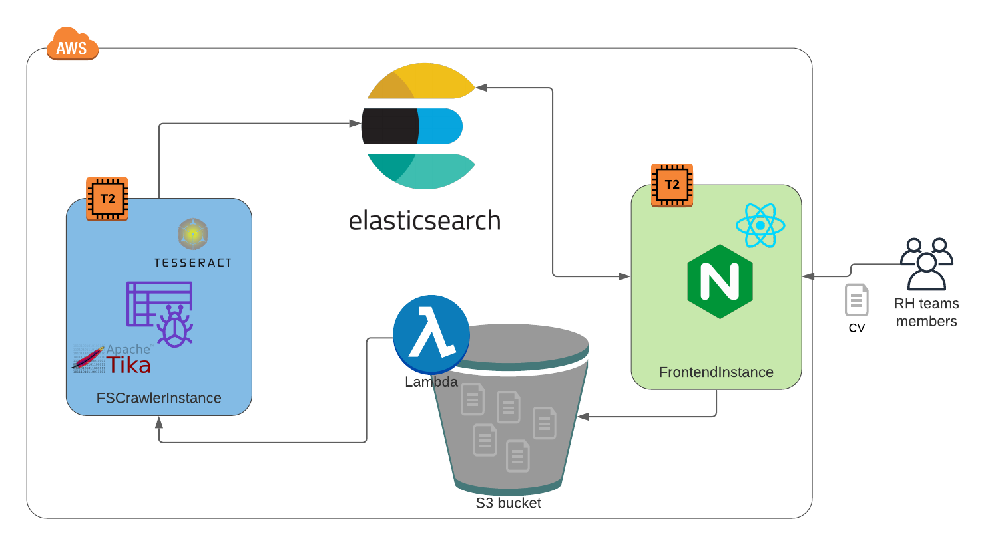

[](https://app.circleci.com/pipelines/github/clequinio5/aws-cvtheque)

# Deployment of a full-cloud cvtheque in AWS

## Stack

### Frontend

- ReactJS
- ReactiveSearch
- Bootstrap
- ReactDnd

### Backend

- AWS Bucket
- AWS Lambda
- AWS Elasticsearch Domain
- FSCrawler as REST service (Apache Tika, Tesseract OCR)

### CI/CD

- Github
- CircleCI

## Overview



## Prerequisite

- AWS account with AWS access key
- CircleCI account

## Deploy

1) Generate a new key-pair named 'fscrawler' in AWS and add the private key in the CircleCI project settings. Change the fingerprint in the config.yml with the one generated from the private key.

2) Add the CircleCI project environment variables:

```
AWS_ACCESS_KEY_ID
AWS_SECRET_ACCESS_KEY
```

3) Run the CircleCI CI/CD pipeline

